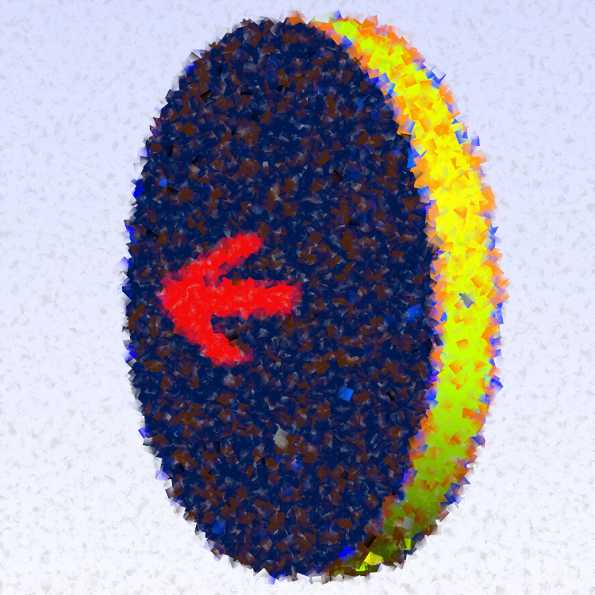

.. ADE-DG documentation master file, created by
   sphinx-quickstart on Mon Jul 21 12:59:59 2025.
   You can adapt this file completely to your liking, but it should at least
   contain the root `toctree` directive.

Templates
=============================

.. This is a comment :-)
   I added the following figure to the index, as this copies (by sphinx) the logo for the template into an build/install directory
   Otherwise I do not know how to do this 

.. toctree::
   :maxdepth: 2
   :caption: Template Gallery

   Basic template for fitting data (without GUI) <templates/Template-fitting-data>
   Testing different Python packages for fitting data (scipy.optimize, lmfit with models, lmfit with custom minimizer) <templates/ADE-DG-fitting-data>
   Add other templates here!

